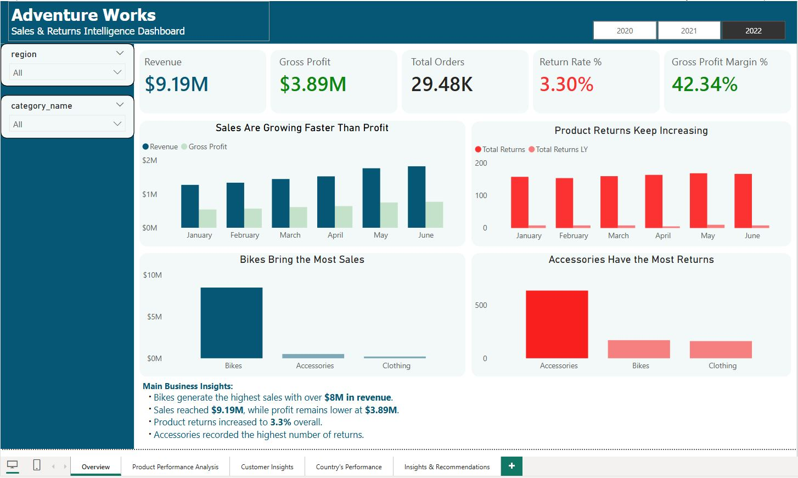
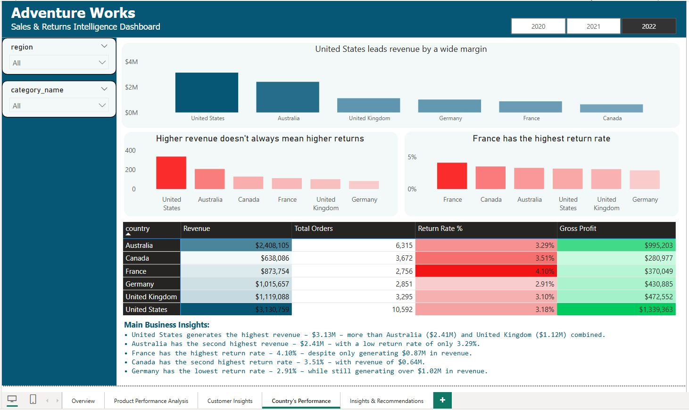
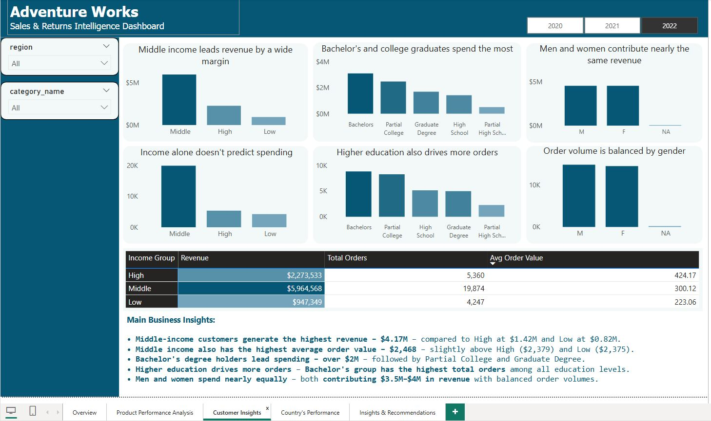
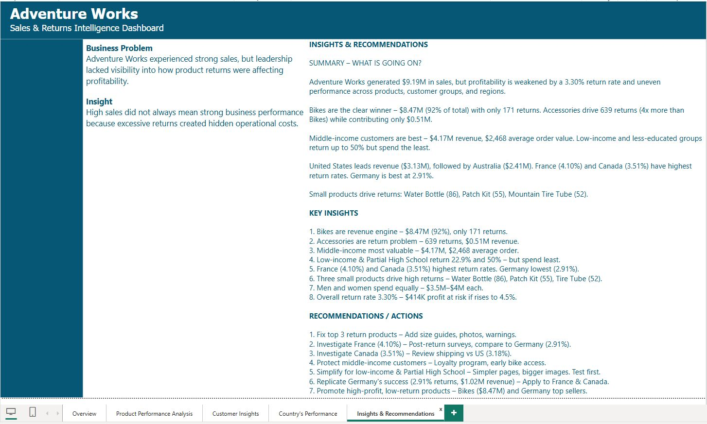

# Adventure Works Sales & Returns Intelligence Dashboard

**High sales do not always equal high profitability — returns reveal hidden business risks.**

## 📌 Project Overview

This dashboard helps the **Sales & Operations Leadership Team** understand:
- Which products and categories drive revenue
- Which products have high return rates  
- Which regions are underperforming due to excessive returns
- Which customer segments contribute most to sales
- Whether sales growth translates into profitability

**Data Source:** Microsoft Adventure Works sample dataset

## 🎯 Key Metrics

| Metric | Value |
|--------|-------|
| Total Revenue | **$9.19M** |
| Gross Profit | **$3.89M** |
| Return Rate | **3.30%** |
| Total Orders | **29.48K** |
| Gross Profit Margin | **42.34%** |

## 🛠️ Tools Used

- **Power BI** – Dashboard creation & visualization
- **DAX** – Calculated measures (return rate, profit margin)
- **Excel/CSV** – Data source

## 📊 Dashboard Pages (5 Pages)

| Page | Focus | Key Visuals |
|------|-------|-------------|
| **Page 1 – Overview** | Executive KPIs + trends | Revenue trend, returns trend, category revenue |
| **Page 2 – Product Performance** | Product-level analysis | Top products, returns by product/category |
| **Page 3 – Customer Insights** | Customer segmentation | Revenue by income, education, gender |
| **Page 4 – Country Performance** | Regional analysis | Revenue by country, return rate by country |
| **Page 5 – Insights & Recommendations** | Executive summary | Key insights + actionable recommendations |

## 📈 Key Insights (Data-Driven)

1. **Bikes generate $8.47M** – 92% of total revenue – with only 171 returns
2. **Accessories drive 639 returns** – 4x more than Bikes – but only $0.51M revenue
3. **Middle-income customers drive $4.17M** with $2,468 avg order value – best segment
4. **France (4.10%) & Canada (3.51%)** have highest return rates
5. **Germany has lowest return rate (2.91%)** with strong revenue ($1.02M)
6. **Top return products:** Water Bottle (86), Patch Kit (55), Mountain Tire Tube (52)

## ✅ Recommendations

| # | Action | Expected Impact |
|---|--------|------------------|
| 1 | Fix top 3 return products (size guides, photos, warnings) | Reduce returns by 30% |
| 2 | Investigate France & Canada (post-return surveys) | Lower return rates to 3.2% |
| 3 | Protect middle-income customers (loyalty program) | +10% retention |
| 4 | Replicate Germany's return policy model | Save $100K annually |
| 5 | Promote high-profit, low-return products (Bikes) | Increase margin |

## 🖼️ Dashboard Screenshots

### Page 1 – Overview

### Page 2 – Product Performance

### Page 3 – Customer Insights

### Page 4 – Country Performance

### Page 5 – Insights & Recommendations

## 📂 Repository Structure

## 🚀 How to Use

1. Download `AdventureWorks_Dashboard.pbix`
2. Open in **Power BI Desktop** (free)
3. Use slicers to filter by: Region, Category, Date
4. Navigate through 5 pages using bottom tabs

## 👩‍💻 Author

**Reginald Higoy**  
https://www.linkedin.com/in/reginaldhigoy/ 

## 📅 Project Date
May 10, 2026

This project is for portfolio purposes only.
